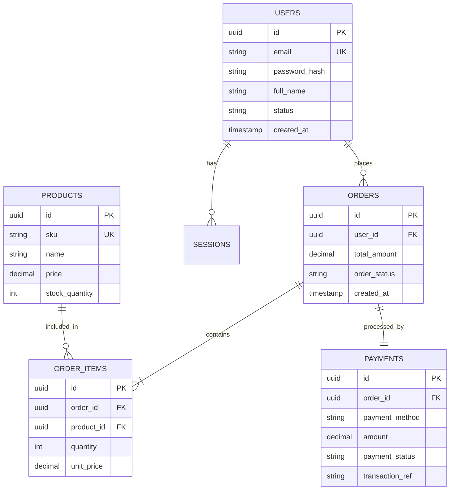

# Sơ đồ Quan hệ Thực thể (Entity Relationship Diagram - ERD)

```mermaid
erDiagram
    USERS ||--o{ ORDERS : places
    USERS ||--o{ SESSIONS : has
    ORDERS ||--|{ ORDER_ITEMS : contains
    PRODUCTS ||--o{ ORDER_ITEMS : included_in
    ORDERS ||--|| PAYMENTS : processed_by

    USERS {
        uuid id PK
        string email UK
        string password_hash
        string full_name
        string status
        timestamp created_at
    }

    ORDERS {
        uuid id PK
        uuid user_id FK
        decimal total_amount
        string order_status
        timestamp created_at
    }

    ORDER_ITEMS {
        uuid id PK
        uuid order_id FK
        uuid product_id FK
        int quantity
        decimal unit_price
    }

    PRODUCTS {
        uuid id PK
        string sku UK
        string name
        decimal price
        int stock_quantity
    }

    PAYMENTS {
        uuid id PK
        uuid order_id FK
        string payment_method
        decimal amount
        string payment_status
        string transaction_ref
    }
```
